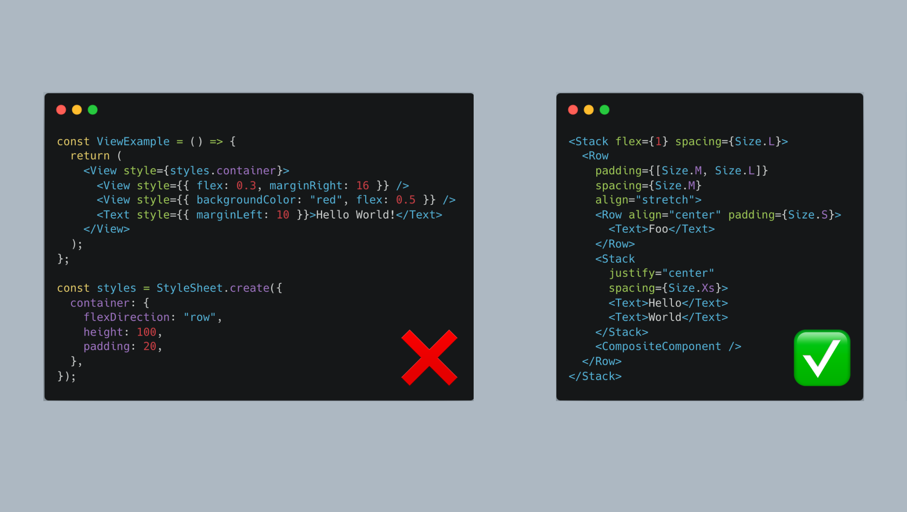

# react-native-layout-primitives

[](https://www.npmjs.com/package/react-native-layout-primitives)
[](https://bundlephobia.com/result?p=react-native-layout-primitives)
[](https://github.com/expo/expo)
[](https://github.com/expo/expo)
[](https://github.com/expo/expo)
[](https://github.com/rgommezz/react-native-layout-primitives/blob/master/LICENSE)

A collection of layout components based on `View` designed to supercharge your UI development process.



- [Motivation](#motivation)
- [Installation](#installation)
- [Usage](#usage)
- [API](#api)
  - [`Stack`](#stack)
  - [`Row`](#row)
  - [`AbsoluteStack`](#absolutestack)
  - [`Size`](#size)
- [Example](#example)
- [Contributing](#contributing)
- [License](#license)

## Motivation

Layout is one of the most overlooked aspects of design systems. React Native provides the `View` component as the foundational
building block for user interfaces. This low-level primitive offers significant flexibility, including over 50 style properties.
However, when you have that many options it's a breeze to end up with messy code, characterized by:

- Mixing inline styles with styles defined in `StyleSheet`.
- Utilizing arbitrary values, or "magic numbers."
- An over reliance on margins, the devil of layout
- Disrupting the natural top-to-bottom flow due to styles being placed at the bottom of the file.
- A lack of separation of concerns, with the `Text` component also handling layout responsibilities.
- Non-adherence to design system conventions.

This library aims to introduce the right abstractions on top of `View` to address these issues,
establishing clear rules and guidelines supported by industry-leading experts:

- **Components should be free of surrounding white space.**
- **Layout components are responsible for managing whitespace.**
- **The use of margins is generally prohibited, except for negative margins.**

These principles let you approach layout with the precision of a designer.

For those interested in exploring these concepts further, the article [**Rethinking Layout Practices**](https://www.reactnative.university/blog/rethinking-layout-practices) provides an in-depth analysis.

## Installation

```sh
npm install react-native-layout-primitives
```

## Usage

```jsx
import {
  Stack,
  Row,
  AbsoluteStack,
  Size,
} from 'react-native-layout-primitives';

const App = () => (
  <Stack flex={1}>
    <Row background="lightblue" padding={[Size.M, Size.L]} spacing={Size.M}>
      <Row align="center" padding={Size.S}>
        <Text>Foo</Text>
      </Row>
      <Stack justify="center" padding={Size.S} spacing={Size.Xs}>
        <Text>Hello</Text>
        <Text>World</Text>
      </Stack>
      <Stack width="100%" height={100} background="red" borderRadius={Size.S} />
    </Row>
    <Row flex={1} background="gray" padding={Size.Xl} spacing={Size.L}>
      <Stack grow={1}>
        <Button />
      </Stack>
      <Stack basis={120}>
        <Button />
      </Stack>
    </Row>
    <AbsoluteStack
      width={100}
      height={100}
      bottom={Size.M}
      right={Size.M}
      background="black"
    />
  </Stack>
);
```

## API
This library provides three layout components and a valuable enum for grid-based spacing.

### `Stack`

The `Stack` component is essential for layout tasks, stacking children vertically by default, akin to the `View` component.
It extends the `ViewProps` interface, allowing it to accept all the properties available to `View`.
Additionally, it introduces the following properties to control layout:

```ts

// See the `Size` enum for possible values
type `GridValue` = `Size` | 0

interface StackProps extends ViewProps {
  flex?: number;
  direction?: FlexStyle['flexDirection'];
  padding?:
    | GridValue
    | [GridValue]
    | [GridValue, GridValue]
    | [GridValue, GridValue, GridValue, GridValue];
  spacing?: GridValue;
  justify?: FlexStyle['justifyContent'];
  align?: FlexStyle['alignItems'];
  wrap?: FlexStyle['flexWrap'];
  borderRadius?: number;
  background?: string;
  grow?: number;
  shrink?: number;
  basis?: number;
  width?: number | DimensionValue;
  height?: number | DimensionValue;
  children?: React.ReactNode;
}
```

As a last resort, you can always use the `style` prop to pass custom styles.

### `Row`
A container that stacks children horizontally. It serves as syntactic sugar for a `Stack` with `direction="row"`.
By default, it wraps them into multiple lines and offers the same properties as the `Stack` component.

### `AbsoluteStack`
A container with absolute positioning. It serves as syntactic sugar for `Stack` with `position="absolute"`.
In addition to all `Stack` properties, it introduces four new ones: `top`, `right`, `bottom`, and `left`.

### `Size`

`Size` is a practical numerical enum that adopts the t-shirt sizing convention. This approach is preferred over using strings, like
`m` or `s`, because it enables mathematical operations in specific scenarios, such as:
- Creating multiples of a size, indicated by values like `XXl` or `XXXl`.
- Adding or subtracting sizes to devise custom spacing, exemplified by `Size.M + Size.Xs`.

```ts
enum Size {
  None = 0,
  Xs = 4,
  S = 8,
  M = 16,
  L = 24,
  Xl = 32,
}

```

## Example
You can play with the Expo example app in the `example` folder. To run it, follow these steps:

```sh
cd example
npm install
npm start
```

Alternatively, you can run the example app in the browser by visiting this [snack link](https://snack.expo.dev/@rgommezz/react-native-layout-primitives-example).

## Contributing

See the [contributing guide](CONTRIBUTING.md) to learn how to contribute to the repository and the development workflow.

## License

MIT

---

Made with [create-react-native-library](https://github.com/callstack/react-native-builder-bob)
